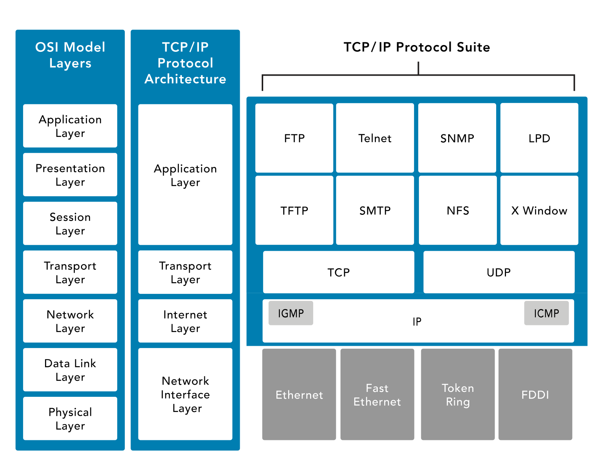
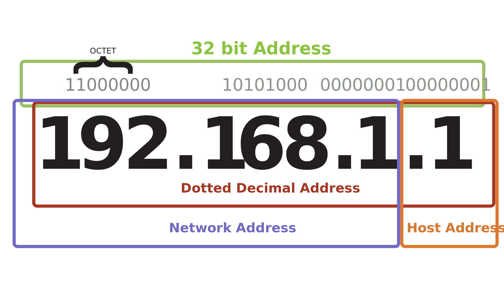

# Computer Networking
A network is two or more computers linked together to share data,
information or resources.

## Types of Networks
* Local area network (LAN) 
    * A local area network (LAN) is a network typically spanning a single floor or building. This is commonly a limited geographical area. 
* Wide are network (WAN)
    * Wide area network (WAN) is the term usually assigned to the long-distance connections between geographically remote networks.

## Media Access Control (MAC) Address
Every network device is assigned a Media Access Control (MAC) address. 
An example is 00-13-02-1F-58-F5. The first 3 bytes (24 bits) of the 
address denote the vendor or manufacturer of the physical network 
interface. No two devices can have the same MAC address in the same 
local network; otherwise an address conflict occurs.

## Internet Protocol (IP) Address 
While MAC addresses are generally assigned in the firmware of the 
interface, IP hosts associate that address with a unique logical 
address. This logical IP address represents the network interface 
within the network and can be useful to maintain communications when a 
physical device is swapped with new hardware. Examples are 192.168.1.1 
and 2001:db8::ffff:0:1. 

# The OSI model
The *OSI model* is a theoretical model for how protocols should function.
The *OSI model* divides networking tasks into seven distinct layers. Flow
of data starts at the application layer(7), and works its way down to 
the physical layer(1) to be ready to sent to another computer. This flow
of data down layers is called `Encapsulation`. 

`Encapsulation` more specifically is the addition of `header` and 
possibly `footer` data by a `protocol` used by that layer of the 
*OSI model*. For each time data is `encapsulated`, the data grows in
size.

`De-encapsulation` is when data moves up the *OSI model* from physical(1)
to application(7). As data moves up the *OSI model*, the data decreases
in size because we are discarding the `header` and `footer` data from the
previous layer.

Brief examples of each layer:
6. When someone references an image file like a JPEG or PNG, we are talking about the Presentation Layer (6). 
5. When discussing logical ports such as NetBIOS, we are discussing the Session Layer (5).
4. When discussing TCP/UDP, we are discussing the Transport Layer (4).
3. When discussing routers sending packets, we are discussing the Network Layer (3). 
2. When discussing switches, bridges or WAPs sending frames, we are discussing the Data Link Layer (2). 
1. Data that was sent through the ethernet cable is converted into binary

## Transmission Control Protocol/Internet Protocol (TCP/IP)
The most widely used protocol suite is TCP/IP, but it is not just a 
single protocol; rather, it is a protocol stack comprising dozens of 
individual protocols. TCP/IP is a platform-independent protocol based on
open standards. The TCP/IP protocol stack focuses on the core functions 
of networking.

| TCP/IP Layers | Layer's Purpose |
|--|--|
| Application Layer | Defines the protocols for the transport layer. |
| Transport Layer | Permits data to move among devices. |
| Interent Layer | Creates/inserts packets. |
| Network Interface Layer | How data moves through the network. |

## Internet Protocol (IPv4 / IPv6)
An IPv4 address is expressed as four octets separated by a dot (.).

With the ever-increasing number of computers and networked devices, it 
is clear that IPv4 does not provide enough addresses for our needs. To 
overcome this shortcoming, IPv4 was sub-divided into public and private 
address ranges. Public addresses are limited with IPv4, but this issue 
was addressed in part with private addressing. Private addresses can be 
shared by anyone, and it is highly likely that everyone on your street 
is using the same address scheme.

This table shows the private addresses available for anyone to use:

| Range | 
|--|
| 10.0.0.0 to 10.255.255.254 |
| 172.16.0.0 to 172.31.255.254 | 
| 192.168.0.0 to 192.168.255.254 |

The first octet of 127 is reserved for a computer’s loopback address. 
Usually, the address 127.0.0.1 is used. The loopback address is used to 
provide a mechanism for self-diagnosis and troubleshooting at the 
machine level. This mechanism allows a network administrator to treat a 
local machine as if it were a remote machine and ping the network 
interface to establish whether it is operational.

IPv6 is a modernization of IPv4, which addressed a number of weaknesses 
in the IPv4 environment. An IPv6 address is shown as 8 groups of four 
digits. Instead of numeric (0-9) digits like IPv4, IPv6 addresses use 
the hexadecimal range (0000-ffff) and are separated by colons (:) rather
than periods (.). An example IPv6 address is 
`2001:0db8:0000:0000:0000:ffff:0000:0001`. To make it easier for humans 
to read and type, it can be shortened by removing the leading zeros at 
the beginning of each field and substituting two colons (::) for the 
longest consecutive zero fields. All fields must retain at least one 
digit.

## Terminology
> **Encapsulation** *`defn.`* The addition of `header` and `footer` to data as that data travels from the physical layer(1) to application layer(7)

> **Header** *`defn.`*

> **Footer** *`defn.`*

> **Hub** *`defn.`* Hubs are used to connect multiple devices in a network. They’re less likely to be seen in business or corporate networks than in home networks. Hubs are wired devices and are not as smart as switches or routers.

> **Switch** *`defn.`* Wired devices that know the addresses of the devices connected to them and route traffic to that port/device rather than retransmitting to all devices. Offering greater efficiency for traffic delivery and improving the overall throughput of data, switches are smarter than hubs, but not as smart as routers. Switches can also create separate broadcast domains when used to create VLANs, which will be discussed later.

> **Router** *`defn.`* Routers are used to control traffic flow on networks and are often used to connect similar networks and control traffic flow between them. Routers can be wired or wireless and can connect multiple switches. Smarter than hubs and switches, routers determine the most efficient “route” for the traffic to flow across the network.

> **Firewall** *`defn.`* a network device used to filter traffic. It is typically deployed between a private network and the internet, but it can also be deployed between departments (segmented networks) within an organization (overall network). Firewalls filter traffic based on a defined set of rules, also called filters or access control lists.

> **Server** *`defn.`* A computer that provides information to other computers on a network.

> **Endpoint** *`defn.`* Endpoints are the ends of a network communication link. One end is often at a server where a resource resides, and the other end is often a client making a request to use a network resource. An endpoint can be another server, desktop workstation, laptop, tablet, mobile phone or any other end user device.

> **Physical Ports** *`defn.`* Physical ports are the ports on the routers, switches, servers, computers, etc. that you connect the wires, e.g., fiber optic cables, Cat5 cables, etc., to create a network.

> **Logical Ports** *`defn.`* A logical port (also called a socket) is little more than an address number that both ends of the communication link agree to use when transferring data.

