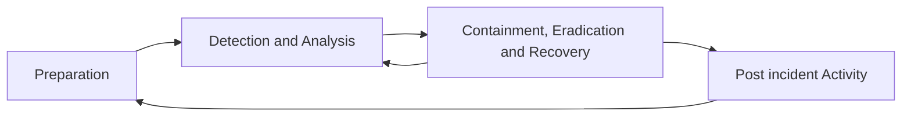

# Incident Response
The *incident response plan* responds to unexpected changes in operating
conditions to keep the business operating.

## Compenents of the Incident Response Plan
The *incident response plan* may contain several procedures and
standards related to incident response.

Components commonly found in an *incident response plan*:
<TAB>

<TAB>

**Preparation**
-   Develop a policy approved by management.
-   Identify critical data and systems, single points of failure.
-   Train staff on incident response.
-   Implement an incident response team. (covered in subsequent topic)
-   Practice Incident Identification. (First Response)
-   Identify Roles and Responsibilities.
-   Plan the coordination of communication between stakeholders.
    -   Consider the possibility that a primary method of communication may not be available.

**Detection and Analysis**
-   Monitor all possible attack vectors.
-   Analyze incident using known data and threat intelligence.
-   Prioritize incident response.
-   Standardize incident documentation.

**Containment, Eradication and Recovery**
-   Gather evidence.
-   Choose an appropriate containment strategy.
-   Identify the attacker.
-   Isolate the attack.

**Post incident Activity**
-   Identify evidence that may need to be retained.
-   Document lessons learned.
Retrospective
-   Preparation
-   Detection and Analysis
-   Containment, Eradication and Recovery
-   Post-incident Activity

## Terminology
> **Security Operations Center** *`defn.`* A centralized organizational function fulfilled by an information security team that monitors, detects and analyzes events on the network or system to prevent and resolve issues before they result in business disruptions.

> **Breach** *`defn.`* The loss of control or unauthorized disclosure of data

> **Event** *`defn.`* Any observable occurrence in a network or system

> **Exploit** *`defn.`* A particular attak. i.e. Vulnerabilities are  exploited

> **Incident** *`defn.`* An event that actually or potentially jeopardizes the confidentiality, integrity or availability of an information system or the information the system processes, stores or transmits.

> **Intrusion** *`defn.`* A security event, or combination of events, that constitutes a deliberate security incident in which an intruder gains, or attempts to gain, access to a system or system resource without authorization.

> **Threat** *`defn.`* Any circumstance or event with the potential to adversely impact organizational operations

> **Vulnerability** *`defn.`* Weakness in an information system, system security procedures, internal controls or implementation that could be exploited by a threat source.

> **Zeroday** *`defn.`* A previously unknown system vulnerability with the potential of exploitation without risk of detection or prevention because it does not, in general, fit recognized patterns, signatures or methods.

